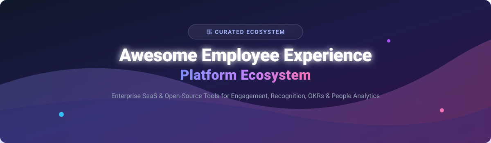

# 🚀 Awesome Employee Experience Platform Ecosystem

  
  
  
  

## 🌟 Top Employee Experience Platforms Ecosystem

**Curated List of SaaS Products & Open-Source GitHub Projects**

*Focused on Employee Engagement, Performance Management, Recognition & People Analytics*

**Last updated: September 2026**

Welcome to the ultimate **Awesome Employee Experience Platform Ecosystem** guide! This repository tracks top **SaaS platforms**, enterprise HR technology, and self-hosted **open-source projects** designed to improve employee experience (EX), performance reviews, pulse survey feedback, peer recognition, and workplace culture.

---

## 📑 Table of Contents
- [📊 Market Overview & Industry Insights](#-market-overview--industry-insights)
- [💼 SaaS / Hosted Platforms](#-saas--hosted-platforms)
- [💻 Open-Source GitHub Projects](#-open-source-github-projects)
- [🤝 How to Contribute](#-how-to-contribute)
- [☕ Support & Acknowledgments](#-support--acknowledgments)
- [⚠️ Disclaimer](#%EF%B8%8F-disclaimer)
- [📈 Star History](#-star-history)

---

## 📊 Market Overview & Industry Insights

The global **Employee Experience Platform (EXP) market size** is estimated at **$7.5 Billion to $8.2 Billion in 2026** and is projected to reach **$16.8 Billion by 2032** (CAGR ~12.5%). 

The sector is currently **moderately fragmented**. While legacy HCM suites (SAP SuccessFactors, Workday) and tech giants (Microsoft Viva, Zoom Workvivo) hold strong enterprise share, specialized category leaders (Lattice, Culture Amp, 15Five, Leapsome) continue to thrive in the mid-market. Open-source solutions are rapidly gaining traction for privacy-conscious enterprise deployments.

---

## 💼 SaaS / Hosted Platforms

Below is the comparative breakdown of top commercial SaaS platforms, ordered by company size (valuation / estimated ARR descending):

| Platform | Description & Key Features | Pricing (Starting Tier) | Free Tier Limit / Trial Duration | Company Size (Valuation / Revenue) |
| :--- | :--- | :--- | :--- | :--- |
| **[Lattice](https://lattice.com/)** | All-in-one performance, engagement surveys, OKRs, and career development platform. | $11/user/month (Performance + Engagement, min. $4,000/year contract) | No free tier; 14-day requestable sales trial | **$3.0 Billion Valuation** (~$127.1M ARR) |
| **[Culture Amp](https://www.cultureamp.com/)** | Enterprise-grade survey science, 360 performance reviews, and people analytics. | $4,500/year base tier (for teams up to 150 employees) | No free tier; No public free trial (sales demo only) | **$1.5 Billion Valuation** (~$227.2M ARR) |
| **[Leapsome](https://www.leapsome.com/)** | Modular platform combining OKRs, performance reviews, pulse surveys, and learning. | $8/user/month (billed annually) | No free tier; 14-day full feature free trial | **~$300 Million Valuation** (~$35M ARR) |
| **[Workvivo](https://www.workvivo.com/)** | Digital workplace and employee social network platform (acquired by Zoom). | $20,000/year minimum enterprise contract (~$5–$8/user/mo) | No free tier; 14-day enterprise trial via Zoom sales | **~$222 Million Acquisition** (>$100M ARR) |
| **[Achievers](https://www.achievers.com/)** | Enterprise peer-to-peer recognition, rewards catalog, and employee feedback. | $3/user/month (plus allocated rewards budget) | No free tier; 30-day sandbox demo trial | **~$150 Million Acquisition** (~$50M ARR) |
| **[15Five](https://www.15five.com/)** | Weekly check-ins, continuous feedback, OKR tracking, and manager coaching. | $4/user/month (Billed annually for Perform plan) | No free tier; 14-day full feature free trial | **~$130 Million Valuation** (~$99M ARR) |
| **[Officevibe](https://officevibe.com/)** | Automated engagement pulse surveys, 1-on-1 tools, and manager feedback (by Workleap). | $5/user/month (Essential plan, billed annually) | **Free Forever Tier**: Free up to 10 users | **~$100 Million Parent Valuation** (~$25M ARR) |
| **[Quantum Workplace](https://www.quantumworkplace.com/)** | Employee survey science, goal alignment, continuous feedback, and turnover analytics. | $5,000/year minimum contract (~$6/user/month) | No free tier; 14-day guided product trial | **~$50M–$100M Est. Revenue** (Private) |
| **[Mo](https://www.mo.com/)** | Peer recognition, culture building, work anniversaries, and automated celebrations. | $4/user/month (Starter plan, billed annually) | No free tier; 7-day free trial | **~$28.9 Million ARR** (Growing Fast) |
| **[WorkTango](https://www.worktango.com/)** | Holistic employee experience platform uniting recognition, rewards, and pulse surveys. | $6/user/month (bundled modules, min $3,500/year) | No free tier; 14-day manager trial | **~$25 Million Est. Revenue** (Private) |
| **[TinyPulse](https://www.tinypulse.com/)** | Lightweight weekly pulse surveys, anonymous feedback, and Cheers for Peers (by Limeade). | $5/user/month (billed annually) | No free tier; 14-day free trial (no credit card required) | **~$9.1 Million Acquisition** (~$6.5M ARR) |

---

## 💻 Open-Source GitHub Projects

Self-hosted and source-available tools are ideal for privacy-conscious HR operations. Repositories are sorted by **GitHub Stars_Count (descending)**:

* **[Erxes](https://github.com/erxes/erxes)** 
  Source-available experience management infrastructure (HubSpot + Qualtrics alternative). XOS (Experience Operating System) covers customer experience, employee experience, and feedback pipelines. Built with TypeScript & Microservices architecture.
* **[Avalia 360](https://github.com/JohnPitter/avalia-360)** 
  360-degree feedback application for teams. Features Excel import, automatic email invitations via EmailJS, AES-256 encryption, real-time dashboards, guaranteed anonymity, and multi-language support (Node.js & Firebase).
* **[Good Job](https://github.com/dongitran/Good-Job)** 
  Peer-to-peer employee recognition and reward platform. Features points tied to core values, redeemable rewards catalog, leaderboards, admin analytics, real-time SSE feed, and multi-tenant org isolation (React 18 & NestJS).
* **[BurningOKR](https://github.com/qaware/burn-okr)** 
  Comprehensive goal tracking and OKR (Objectives and Key Results) management web application built for transparent organizational alignment (Angular & Spring Boot).
* **[Alignify](https://github.com/iam-tsr/alignify)** 
  AI-powered employee engagement platform. Conducts anonymous surveys, uses Qwen model for question generation, and DistilBERT for feedback classification with automated improvement suggestions.
* **[okr-tracker](https://github.com/oslokommune/okr-tracker)** 
  Goal tracking tool built by Oslo Kommune. A clean, simple web app to track company, team, and individual OKRs with progress visualizations (Vue.js & Firebase).
* **[Open Pulse Survey](https://github.com/BrainStation-23/openpulsesurvey)** 
  Comprehensive survey management platform designed for enterprises to create, distribute, and analyze pulse surveys with real-time analytics.
* **[PulseForms](https://github.com/Krissjop331/PulseForms)** 
  Django-based survey platform with custom user roles, privacy controls, conditional logic, response limits, time windows, and CSV/JSON exports.
* **[Digital Workplace Employee Hub](https://github.com/WRVish/digital-workplace-employee-hub)** 
  Free employee portal for Microsoft 365 (SPFx & Power Apps). Features user management, leave administration, asset management, and ticketing.
* **[RecognizeIt](https://github.com/ninshiki-project/RecognizeIt-backend-community)** 
  Backend skeleton for peer recognition platforms built with Laravel. Facilitates colleague acknowledgment and points system to boost workplace culture.
* **[threesixty](https://github.com/thermondo/threesixty)** 
  Lightweight multi-rater 360-degree feedback tool built for minimalist performance review workflows.

---

## 🛠️ Frameworks for Building Custom EX Systems

If you are building a custom HR tech stack, consider combining:
- **Erxes**: Base experience infrastructure & CRM
- **Good Job** or **RecognizeIt**: Peer kudos & rewards module
- **Avalia 360** or **threesixty**: 360-degree review module
- **BurningOKR** or **okr-tracker**: Goal alignment & OKR engine
- **PulseForms** or **Alignify**: Survey & AI analytics engine

---

## 🤝 How to Contribute

Contributions are warmly welcomed! To add or update an entry:
1. Fork the repository.
2. Update `README.md` keeping the Markdown formatting intact.
3. Submit a Pull Request with a short summary of the additions.

---

## ☕ Support & Acknowledgments

If you find this curated list valuable for your HR team, software project, or research:
- 🌟 **Star this repository** to help others discover it!
- 🔀 **Fork it** to customize your own internal HR evaluation checklist.
- 📢 **Share it** with People Ops, HR Leaders, and Developers.
- ☕ **Buy me a coffee**: Consider sponsoring this project via [GitHub Sponsors](https://github.com/sponsors/ishandutta2007).

---

## ⚠️ Disclaimer

- This list is community-curated for informational purposes.
- Employee experience platforms handle sensitive employee feedback data; ensure full GDPR/HIPAA compliance when implementing any tool.
- Pricing and features are subject to vendor updates.

---

## 📈 Star History

